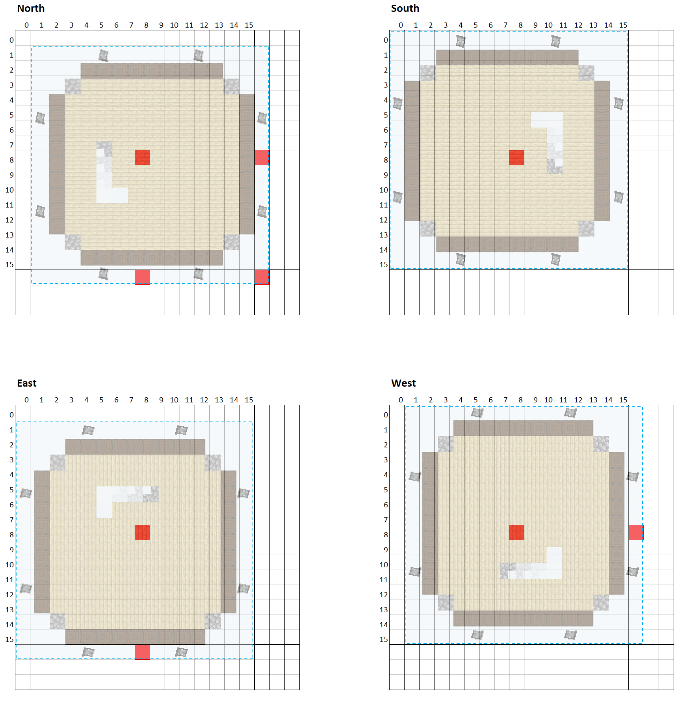
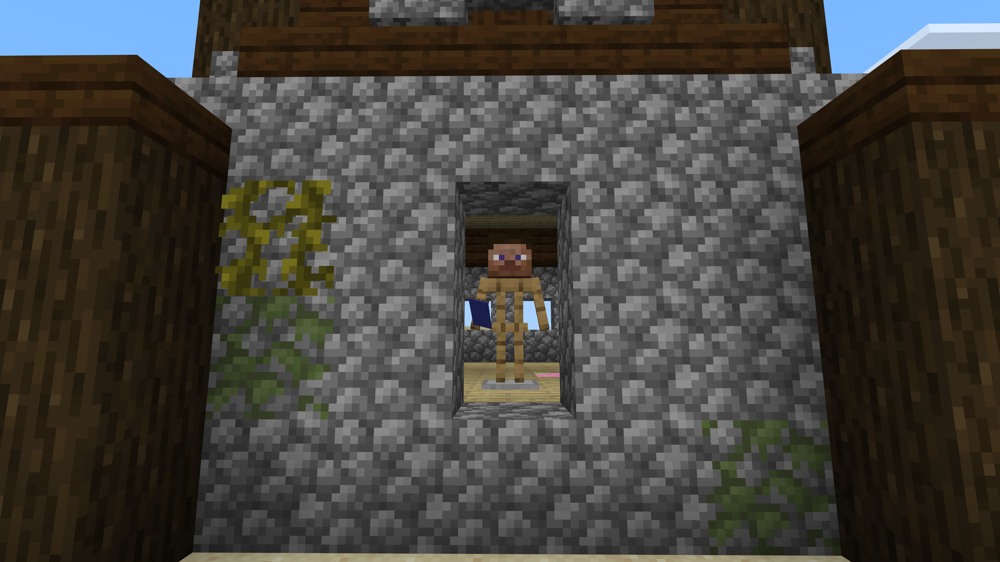
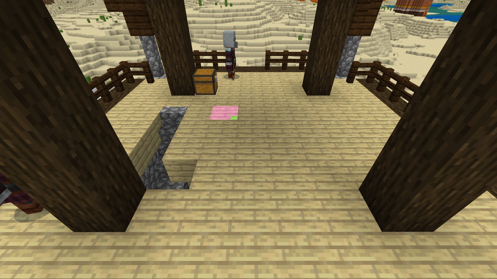

# Minecraft Bedrock, Outpost Spawn Spots V0.0.1

## Description

Raid outposts are similar to witch huts except that the banners can cross chunk borders. It seems this may not have been completely intended that the raid outpost could span into up to 4 chunks depending upon orientation, however Mojang has left this in. There can be 1, 2 or 4 hard coded spawn spots for each outpost. Pillagers will only spawn between y0 from the bottom floor of the outpost, and y+3 from the top floor of the outpost.

The game is meant to create a hard coded spawn spot at block position x8,z8 within the chunk containing the outpost structure. Due to asymmetric positioning of the outpost structure, the structure boundary can bleed into neighboring chunks based on rotation. As a result, the game creates additional hard coded spawn spots in neighboring chunks, nearest to block position x8,z8 as possible while still being between the chunk border and structure boundary.

## Taken from

[Bedrock Technical Resource Pack](https://github.com/RavinMaddHatter/Bedrock-Technical-Resource-Pack)

This strips out the feature into a standalone addon and updates it to support 1.19.30

## How To Use

To use this feature, place an armor stand on the first level (ground floor, bottom floor), ensuring the armor stand is facing the door of the outpost. Equip the armor stand with a **banner**. The armor stand will highlight the hard coded spawn spots for that outpost on the top first level and top level.

* Without proper direction of the armor stand toward outpost door, this feature will not display correct spawn spots.
* Depending on terrain surrounding the outpost, it may be difficult to see the lower highlighted spawn spots. In this case, look at the spawn spots from the top level of the outpost to guide you.

